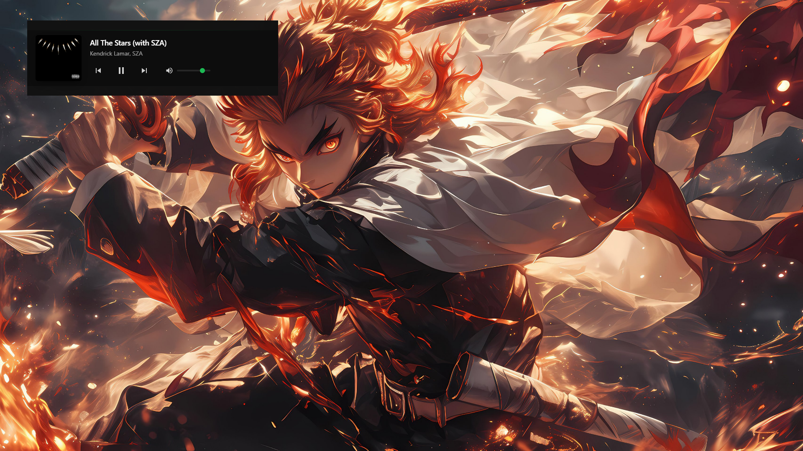

<div align="center">

# Spotify Native Toggler

## Important: Spotify Premium Required

**This application only works with Spotify Premium accounts.** The Spotify Web API restricts playback control to Premium subscribers only.

**Requirements:**

- **Spotify Premium subscription** (required)
- **Spotify app** installed and running on your device
- **Your own Spotify Developer app** (free setup - instructions below)
- **Node.js** (for building from source only)Spotify playback seamlessly with a beautiful Apple-style interface and customizable global shortcuts\*\*

</div>

## Overview

Spotify Native Toggler is a lightweight, cross-platform desktop application that provides elegant control over your Spotify playback from anywhere on your system. Featuring a stunning glassmorphism design inspired by Apple's UI language, customizable global shortcuts, and comprehensive playback controls including volume and mute functionality.

## Purpose

Modern operating systems often lack unified media controls that work seamlessly across all applications. This tool bridges that gap by providing:

- **Universal Control**: Manage Spotify from any application without interrupting your workflow
- **Beautiful Design**: Apple-inspired glassmorphism interface that blends with any desktop
- **Customizable Shortcuts**: Set your own global keyboard combinations for all controls
- **Complete Functionality**: Full playback control including volume, mute, and track navigation

Perfect for gaming, coding, design work, or any task where you need uninterrupted focus while maintaining control over your music.

## Features

### Core Functionality

| Feature                           | Description                                                  |
| --------------------------------- | ------------------------------------------------------------ |
| **Complete Playback Control**     | Play, pause, next, previous, volume control, and mute        |
| **Apple-Style Interface**         | Beautiful glassmorphism design with dynamic album artwork    |
| **Customizable Global Shortcuts** | Set your own keyboard combinations for all functions         |
| **Advanced Volume Control**       | Dynamic volume slider with visual feedback and instant mute  |
| **Window Management**             | Pin/unpin window, auto-hide functionality, and focus control |
| **Secure Authentication**         | OAuth 2.0 with persistent login and credential management    |

### Interface Features

- **Dynamic Album Artwork**: Real-time display of current track's album cover
- **Smart Auto-Hide**: Window automatically hides when not in use (configurable)
- **Visual Feedback**: Smooth animations and loading states for all interactions
- **Error Handling**: User-friendly notifications for common issues
- **Responsive Design**: Adapts beautifully to different screen sizes

### Global Shortcuts (Customizable)

- **Toggle Window**: Show/hide the player interface
- **Play/Pause**: Smart toggle based on current playback state
- **Next/Previous Track**: Navigate through your playlist
- **Volume Up/Down**: Precise volume control in 10% increments
- **Mute/Unmute**: Instant audio toggle with volume restoration

## ⚠️ Important: Spotify Premium Required

**This application only works with Spotify Premium accounts.** The Spotify Web API restricts playback control to Premium subscribers only.

**Requirements:**

- ✅ **Spotify Premium subscription** (required)
- ✅ **Spotify app** installed and running on your device
- ✅ **Your own Spotify Developer app** (free setup - instructions below)
- ✅ **Node.js** (for building from source only)

## Quick Start

### Option 1: Download Pre-built Release (Recommended)

1. Download the latest release from the [releases page](https://github.com/AlwaysRead/spotify-native-toggler/releases)
2. Run the installer for your platform
3. Follow the setup wizard to configure your Spotify app credentials

### Option 2: Build from Source

```bash
git clone https://github.com/AlwaysRead/spotify-native-toggler.git
cd spotify-native-toggler
npm install
npm start
```

## Setup Instructions

### 1. Create Your Spotify Developer App (One-time setup)

Every user needs their own Spotify app credentials for security:

1. Visit [Spotify Developer Dashboard](https://developer.spotify.com/dashboard)
2. Click **"Create App"**
3. Fill in:
   - **App Name**: "My Spotify Controller" (or any name)
   - **App Description**: "Personal Spotify controller"
   - **Website**: Leave blank or use a placeholder
   - **Redirect URI**: `http://127.0.0.1:3000/callback` **Exact match required**
4. Check **"Web API"** in the APIs section
5. Save the app and note your **Client ID** and **Client Secret**

### 2. First Launch Configuration

When you first run the application:

**Setup Screen:**

- Enter your **Client ID** from step 1
- Enter your **Client Secret** from step 1
- Click **"Save & Continue"**

**Authentication Screen:**

- Click **"Connect to Spotify"**
- Sign in with your **Spotify Premium account**
- Authorize the application
- Wait 3 seconds for the main interface to launch

Your credentials are stored securely on your local machine and never shared.

## Usage

### First Time Users

1. **Setup** → Enter Spotify app credentials
2. **Authenticate** → Connect your Spotify account
3. **Customize** → Click settings gear to configure global shortcuts
4. **Enjoy** → Control Spotify from anywhere!

### Daily Usage

- App remembers your login - just launch and use
- Use global shortcuts from any application
- Click and drag the window to reposition
- Right-click the pin button to keep window always visible

## Default Global Shortcuts

| Shortcut           | Action         | Customizable |
| ------------------ | -------------- | ------------ |
| `Ctrl+Shift+Space` | Toggle Window  | Yes          |
| `Ctrl+Shift+P`     | Play/Pause     | Yes          |
| `Ctrl+Shift+N`     | Next Track     | Yes          |
| `Ctrl+Shift+B`     | Previous Track | Yes          |
| `Ctrl+Shift+Up`    | Volume Up      | Yes          |
| `Ctrl+Shift+Down`  | Volume Down    | Yes          |
| `Ctrl+Shift+M`     | Mute/Unmute    | Yes          |

**Tip**: Click the settings gear icon in the authentication window to customize all shortcuts!

## Interface Guide

### Main Player Window

- **Album Artwork**: Displays current track's cover art
- **Track Info**: Song title and artist name
- **Control Buttons**: Play/pause, previous, next with visual feedback
- **Volume Slider**: Dynamic slider with real-time color changes
- **Pin Button**: Keep window always visible (top-right corner)
- **Auto-Hide**: Window automatically hides when not in focus (unless pinned)

### Settings Panel

- **Accessible from**: Authentication window settings button
- **Real-time Recording**: Click "Record" and press your desired key combination
- **Duplicate Detection**: Prevents conflicting shortcuts
- **Instant Apply**: Changes take effect immediately after saving

## Advanced Features

### Smart Playback Detection

- Automatically detects whether music is playing or paused
- Prevents API conflicts with other Spotify controllers
- Graceful error handling for common issues

### Volume Management

- **10% Increments**: Precise volume control via shortcuts
- **Visual Feedback**: Slider color changes based on volume level
- **Mute Memory**: Remembers volume level when muting/unmuting
- **Real-time Sync**: Volume changes reflect immediately in UI

### Window Behavior

- **Focus Management**: Smart showing/hiding based on user interaction
- **Drag Support**: Click and drag anywhere on the album cover or info area
- **Pin Functionality**: Override auto-hide behavior
- **Smooth Animations**: Polished transitions for all UI changes

## Screenshots

<div align="center">
  
  <p><em>Apple-inspired glassmorphism interface with dynamic album artwork and controls</em></p>

  
  <p><em>Customizable global shortcuts configuration panel</em></p>
</div>

## Troubleshooting

### Common Issues

**"Premium Required" Error**

- Ensure you're using a Spotify Premium account
- Check that Spotify app is running and playing music

**"No Device Found" Error**

- Open Spotify and start playing a song
- Make sure Spotify is the active audio device

**Global Shortcuts Not Working**

- Check for conflicting shortcuts with other applications
- Try different key combinations in the settings panel
- Restart the application after changing shortcuts

**Authentication Failed**

- Verify your Client ID and Secret are correct
- Ensure redirect URI is exactly: `http://127.0.0.1:3000/callback`
- Check that your Spotify app has "Web API" enabled

### Support

- [Report Bugs](https://github.com/AlwaysRead/spotify-native-toggler/issues)
- [Request Features](https://github.com/AlwaysRead/spotify-native-toggler/issues)
- [View Documentation](https://github.com/AlwaysRead/spotify-native-toggler/wiki)

## Contributing

We welcome contributions! Areas where help is especially appreciated:

- **UI/UX Design**: Enhance the visual design and user experience
- **Cross-platform Testing**: Ensure compatibility across different operating systems
- **Feature Development**: Add new functionality and improvements
- **Documentation**: Improve guides and help content

## Future Roadmap

- [ ] **Playlist Management**: Quick playlist switching and management
- [ ] **Theme Customization**: Multiple UI themes and color schemes
- [ ] **Last.fm Integration**: Scrobbling and enhanced metadata
- [ ] **System Tray Mode**: Minimize to system tray option

## License

This project is licensed under the MIT License. See the [LICENSE](LICENSE) file for details.

## Acknowledgments

- **[Spotify Web API](https://developer.spotify.com/documentation/web-api)** - For enabling third-party integrations
- **[Electron](https://www.electronjs.org)** - For cross-platform desktop app framework
- **Apple Design Team** - For inspiration on the glassmorphism interface design
- **Community Contributors** - For bug reports, feature requests, and improvements

## Technical Details

- **Framework**: Electron with Node.js backend
- **Authentication**: OAuth 2.0 Authorization Code Flow
- **API**: Spotify Web API v1
- **UI**: Vanilla HTML/CSS/JS with glassmorphism design
- **Storage**: Local file system for credentials and settings
- **Global Shortcuts**: Native OS integration via Electron

<div align="center">
  <p>Made with care by <a href="https://github.com/AlwaysRead">AlwaysRead</a></p>
  <p>
    <a href="https://github.com/AlwaysRead/spotify-native-toggler/issues">Report Bug</a> •
    <a href="https://github.com/AlwaysRead/spotify-native-toggler/issues">Request Feature</a> •
    <a href="https://github.com/AlwaysRead/spotify-native-toggler/discussions">Discussions</a>
  </p>

  <p>
    
    
  </p>
</div>
